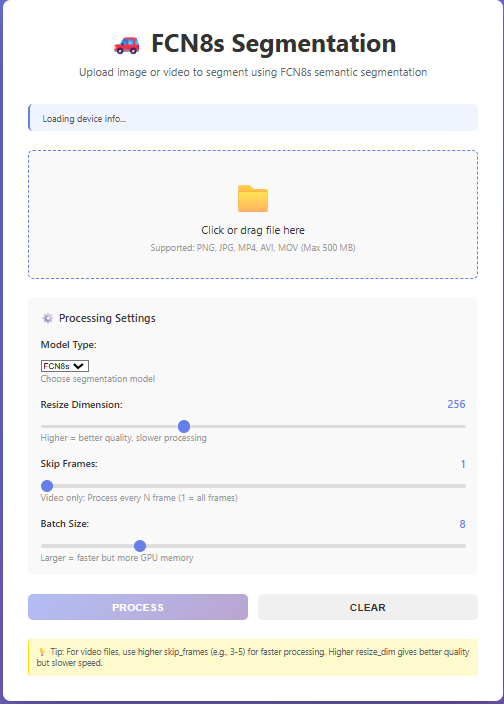

Project Overview

- Purpose: Web UI and API for semantic segmentation using FCN8s and U-Net implemented in PyTorch.
- Web interface: main/app.py serves a simple upload UI at / and endpoints under /api for status, upload, and job status.
- Models: Put your .pth weights in the model/ folder (these files are large and typically excluded from git).

Preview
- Web UI screenshot (rendered from repository file):



Repository layout (important files)
- main/app.py: Flask server, model loading, image/video processing, and API endpoints.
- main/templates/index.html: Web UI served by the app.
- main/requirements.txt: Python dependencies.
- model/: Place best_fcn8s_model.pth and best_unet_model.pth here (not committed).
- axample/Web_image.png: Screenshot used above.

Quick Start (Windows / Conda)

1. Create or activate environment:

```
conda create -n pytorch python=3.10 -y
conda activate pytorch
```

2. Install dependencies:

```
pip install -r main/requirements.txt
```

3. Run the app:

```
cd main
python app.py
```

4. Open the web UI: http://127.0.0.1:5000

How to use
- Web UI: upload an image or video, choose model (fcn8s or unet), set resize_dim, skip_frames, and batch_size, then press Process.
- API endpoints of interest:
  - GET /api/status : returns GPU availability and model load state.
  - POST /api/upload : upload file (image/video) with form fields model_type, resize_dim, skip_frames, batch_size.
  - GET /api/job_status/<job_id> : poll video processing progress.

Notes about the included server code
- main/app.py auto-detects num_classes from model weights using detect_num_classes().
- Update MODEL_CONFIG in main/app.py if you store models in a different path.
- Runtime folders: main/uploads/ and main/outputs/ are created automatically and usually ignored by git.

Testing locally
- There is a lightweight test helper at main/test.py — run it with:

```
python main/test.py
```

Custom training / replacing models

If you want to train your own models (recommended for custom datasets), you can use these reference repos that are compatible with the project's FCN8s / U-Net structure:

- Custom FCN8s training: https://github.com/Azima28/Custom-FCN8S-Segmentations
- Custom U-Net training: https://github.com/Azima28/Custom-U-NET-Segmentations
